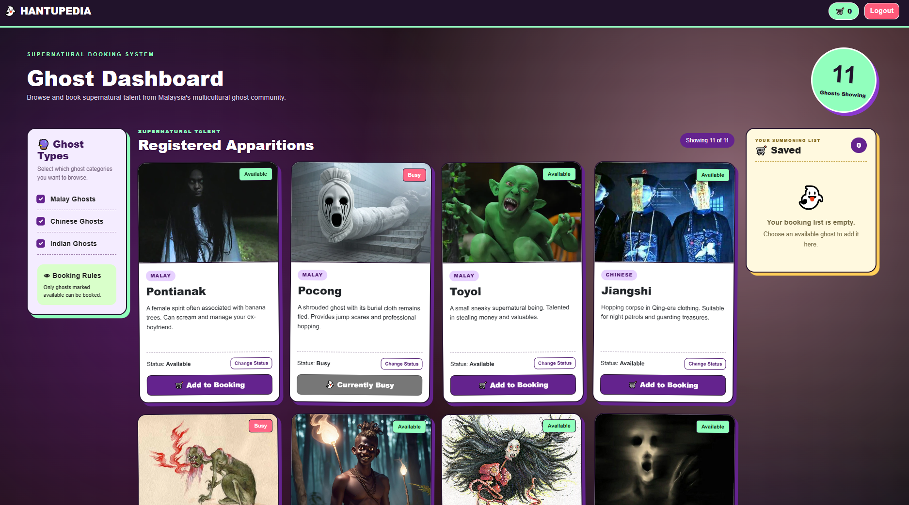

# 👻 HANTUPEDIA

Welcome to **HANTUPEDIA**, Malaysia's premier supernatural talent booking platform.



⚠️ HANTUPEDIA is not responsible for possessions, mysterious disappearances, sudden temperature drops, cursed family bloodlines, or ghosts refusing to clock out.

## 👻 What is HANTUPEDIA?

**HANTUPEDIA** is a React-based ghost booking dashboard inspired by Malaysia's multicultural supernatural folklore.

Users can log in, browse ghosts from different cultural traditions, check whether they're available or busy, filter them by category, and add available ghosts to a booking list.

## Meet the Apparitions

HANTUPEDIA currently features ghosts and supernatural beings from three categories: 
Malay, Chinese and Indian

## Features

- Supernatural Login System
- Protected Dashboard
- Filter Ghosts by Type
- Working Status of Ghosts (Available/Busy)
- Ghost Booking List

## Demo Login

```
Email: admin@hantupedia.com
Password: 123
```

⚠️ Important Disclaimer ⚠️

HANTUPEDIA is a fictional project created for educational purposes.

The ghosts, supernatural beings, descriptions and booking concept are presented as folklore-inspired entertainment.

Please do not attempt to summon anything listed on this website, especially after midnight.

We don't have customer support for that.

Built using:
- JavaScript (ES6)
- React
- HTML
- CSS
- Bootstrap